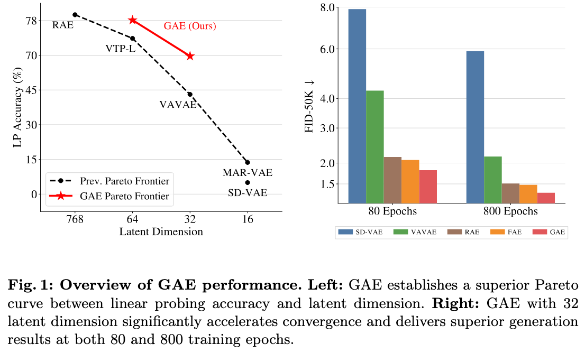
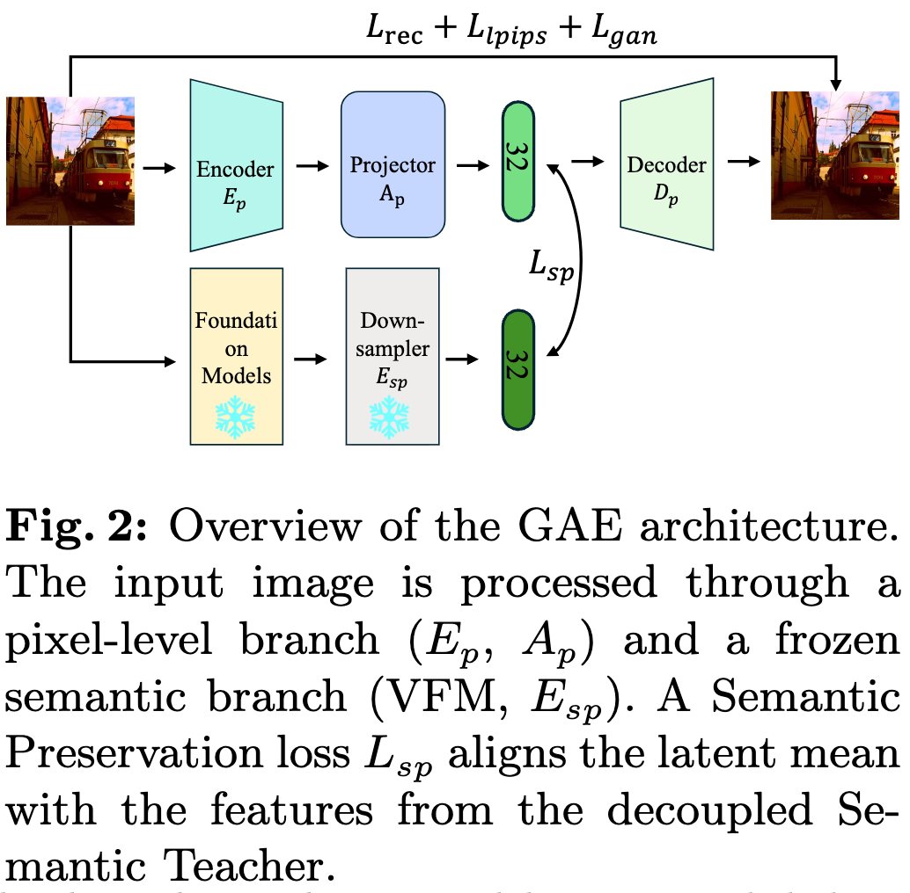
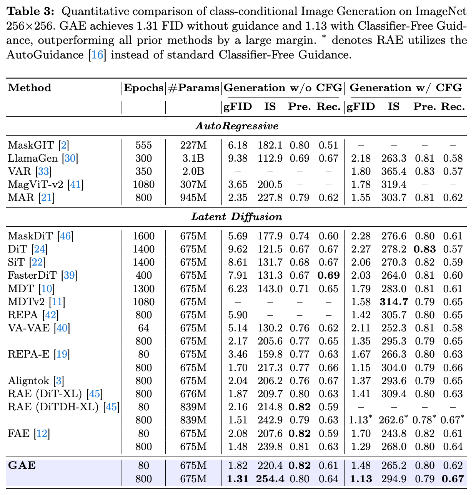
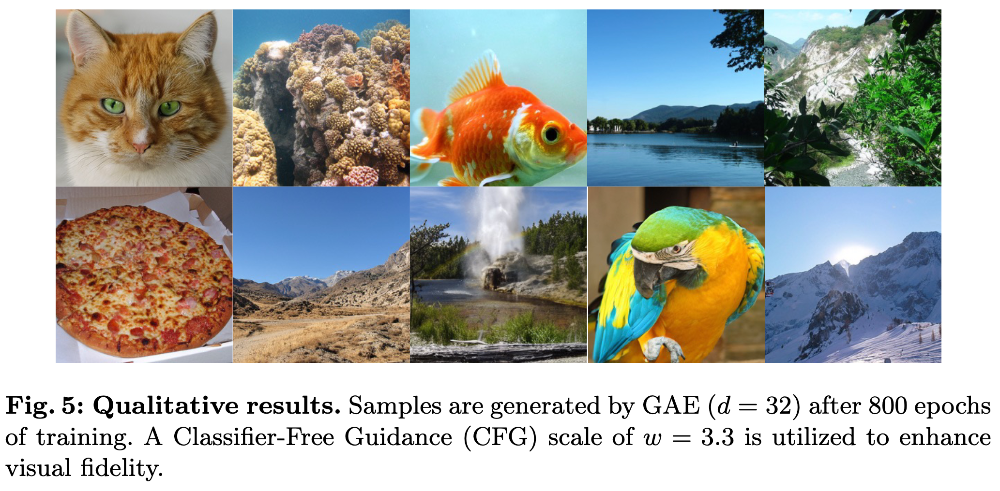

# Geometric Autoencoder for Diffusion Models (GAE) 
[](https://huggingface.co/sii-research/gae-imagenet256-f16d32/tree/main)
[](LICENSE)
[](http://arxiv.org/abs/2603.10365)



## 📄 Abstract

Latent diffusion models have established a new state-of-the-art in high-resolution visual generation. Integrating Vision Foundation Model priors improves generative efficiency, yet existing latent designs remain largely heuristic. These approaches often struggle to unify semantic discriminability, reconstruction fidelity, and latent compactness. In this paper, we propose Geometric Autoencoder (GAE), a principled framework that systematically addresses these challenges. By analyzing various alignment paradigms, GAE constructs an optimized low-dimensional semantic supervision target from VFMs to provide guidance for the autoencoder. Furthermore, we leverage latent normalization that replaces the restrictive KL-divergence of standard VAEs, enabling a more stable latent manifold specifically optimized for diffusion learning. To ensure robust reconstruction under high-intensity noise, GAE incorporates a dynamic noise sampling mechanism. Empirically, GAE achieves compelling performance on the ImageNet-1K $256 \times 256$ benchmark, reaching a gFID of 1.82 at only 80 epochs and 1.31 at 800 epochs without Classifier-Free Guidance, significantly surpassing existing state-of-the-art methods. Beyond generative quality, GAE establishes a superior equilibrium between compression, semantic depth and robust reconstruction stability. These results validate our design considerations, offering a promising paradigm for latent diffusion modeling.

---

## 📢 News
* **[2026.03.10]**: Core code released! Includes DiT training and inference based on GAE latent space.
* **[2026.03.10]**: Pre-trained weights for GAE-AE and DiT are available on [Hugging Face](https://huggingface.co/sii-research/gae-imagenet256-f16d32/tree/main).

---

## 📸 Overview




**Geometric Autoencoder (GAE)** is a principled framework designed to systematically address the heuristic nature of latent space design in Latent Diffusion Models (LDMs). GAE significantly enhances semantic discriminability and latent compactness without compromising reconstruction fidelity through three core innovations:

1. **Latent Normalization**: Replaces the restrictive KL-divergence of standard VAEs with **RMSNorm** regularization. By projecting features onto a unit hypersphere, GAE prevents training collapse and provides a stable, scalable latent manifold optimized for diffusion learning.
2. **Latent Alignment**: Leverages Vision Foundation Models (VFMs, e.g., DINOv2) as semantic teachers. Through a carefully designed semantic downsampler, the low-dimensional latent vectors directly inherit strong discriminative semantic priors.
3. **Dynamic Noise Sampling**: Specifically addresses the high-intensity noise typical in diffusion processes, ensuring robust reconstruction performance even under extreme noise levels.

---


## 📊 Quantitative Analysis



GAE achieves state-of-the-art performance on the ImageNet-1K $256 \times 256$ benchmark.

## 🌟 Visual Results



---

## 📦 Model Zoo & Weights

Some pre-trained weights are hosted on Hugging Face.

| Model | Epochs | Latent Dim | gFID (w/o) | Weights |
| :--- | :---: | :---: | :---: | :---: |
| **GAE-LightningDiT-XL** | 80 | 32 | 1.82 | [🔗 HF Link](https://huggingface.co/sii-research/gae-imagenet256-f16d32/tree/main/d32) |
| **GAE-LightningDiT-XL** | 800 | 32 | 1.31 | [🔗 HF Link](https://huggingface.co/sii-research/gae-imagenet256-f16d32/tree/main/d32) |

---

| Model | Epochs | Latent Dim | Weights |
| :--- | :---: | :---: | :---: |
| **GAE** | 200 | 32  | [🔗 HF Link](https://huggingface.co/sii-research/gae-imagenet256-f16d32/tree/main/d32) |

---

## 🛠️ Usage

We use [LightningDiT](https://github.com/hustvl/LightningDiT) for the DiT implementation.

### 1. Installation
```bash
git clone https://github.com/sii-research/GAE.git
cd GAE
conda create -n gae python=3.10.12
conda activate gae
pip install -r requirements.txt
```

### 2. Extract Latents
Download the pre-trained weights from Hugging Face and place them in the checkpoints/ folder. Ensure update the paths in the configs/ folder to match your local setup.
```bash
bash extract_gae.sh  $DIT_CONFIG $VAE_CONFIG
```
### 3. Training
```bash
bash train_gae.sh  $DIT_CONFIG $VAE_CONFIG
```


### 4. Inference (Sampling)
For class-uniform sampling:
```bash
bash inference_gae.sh  $DIT_CONFIG $VAE_CONFIG
```
For class-random sampling:
```bash
Change "from inference_sample import" -> "from inference import" in inference_gae.py
```
## 🤝 Acknowledgements
Our project is built upon the excellent foundations of the following open-source projects:

* [LightningDiT](https://github.com/hustvl/LightningDiT): For the PyTorch Lightning based DiT implementation.

* [RAE](https://github.com/bytetriper/RAE): For the timeshift and class-uniform sampling implementation.

* [ADM](https://github.com/openai/guided-diffusion): For the evaluation suite to score generated samples.

We express our sincere gratitude to the authors for their valuable contributions to the community.

## 📝 Citation
If you find this work useful, please consider citing:
```bibtex
@misc{liu2026geometricautoencoderdiffusionmodels,
      title={Geometric Autoencoder for Diffusion Models}, 
      author={Hangyu Liu and Jianyong Wang and Yutao Sun},
      year={2026},
      eprint={2603.10365},
      archivePrefix={arXiv},
      primaryClass={cs.CV},
      url={https://arxiv.org/abs/2603.10365}, 
}
```